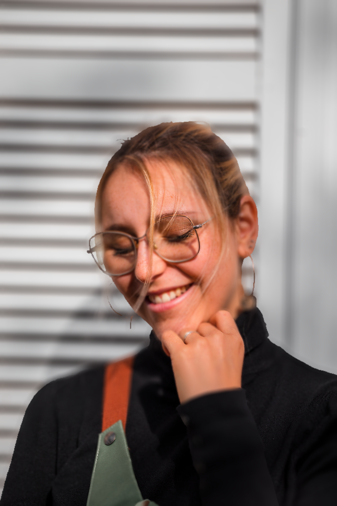

# Depth-of-Field-Implement

A PyTorch implementation of synthetic depth-of-field rendering, inspired by the SIGGRAPH 2018 paper:  
**"Synthetic Depth-of-Field with a Single-Camera Mobile Phone"**  
This project simulates shallow depth-of-field effects using a combination of disparity-based segmentation, layered blurring, and focus compositing.

---

## 🔍 Scatter Blur Method Comparison

This repository includes a comparison of different scatter blur strategies:

<table>
  <tr>
    <td style="width: 33.33%; vertical-align: top; text-align: center; padding: 2px;">
      <br>
      <strong>1. Scatter Blur Only</strong>
    </td>
    <td style="width: 33.33%; vertical-align: top; text-align: center; padding: 2px;">
      <br>
      <strong>2. Scatter Blur with Depth Map</strong>
    </td>
    <td style="width: 33.33%; vertical-align: top; text-align: center; padding: 2px;">
      <br>
      <strong>3. Depth Map + Sub-image Decomposition</strong>
    </td>
  </tr>
</table>


---

### 📝 Description of Each Method

1. **Scatter Blur Only**  
   - Apply circular scatter blur uniformly across the image  
   - No depth information involved  
   - Produces a flat blur without spatial focus differentiation  

2. **Scatter Blur with Depth Map**  
   - Blur strength is modulated by the depth difference from the focal plane  
   - Simulates realistic variation in blur amount across the image  
   - Still applies blur directly on full image  

3. **Scatter Blur with Depth Map and Sub-image Decomposition**  
   - Depth map is used to segment the image into multiple depth bands  
   - Each sub-image is blurred individually with appropriate radius  
   - Finally composited back-to-front for more accurate depth-of-field simulation  
   - Matches the layered approach described in the referenced SIGGRAPH paper  

---

## 🚀 How to Use

You can run the scatter blur methods via command-line:

### 🔸 1 & 2. Scatter Blur and Depth-aware Blur

```bash
python run_scatter_blur.py
```

This will generate:
1. Scatter Blur Only (uniform blur)

2. Scatter Blur with Depth Map (depth-dependent blur)

### 🔸 3. Depth Map + Sub-image Decomposition Blur
```bash
python run_scatter_blur_layer.py
```

This will generate:
3. Decompose into subimage blur based on Depth Map
(layered blur + compositing)

🔧 Available Parameters

- blur_r (int, default=20)
Maximum blur radius applied during scatter blur.

- focal_depth (int, default=128)
The focal depth value (0–255 grayscale) indicating the in-focus plane.

- focal_len (float, default=25.0)
Focal region length controlling the depth tolerance around the focal depth

📝 Input image and depth map paths, along with blur parameters, can be modified inside the script files (e.g. run_scatter_blur.py).

🖼️ Results will be saved in the outputs folder, depending on your configuration.

## 🧪 Requirements

- Python 3.8+
- PyTorch 1.10+
- OpenCV
- NumPy

---

## 📜 License

Licensed under the **Apache License 2.0**. See `LICENSE` for details.