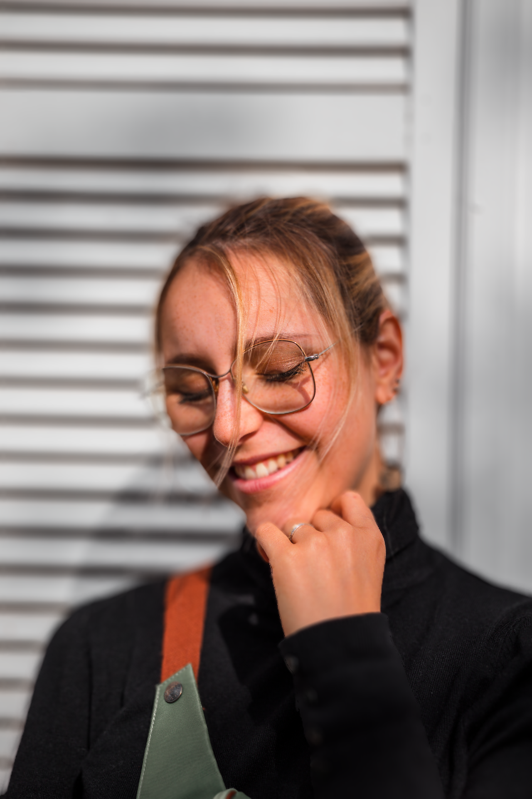

# Depth-of-Field-Implement

A PyTorch implementation of synthetic depth-of-field rendering, inspired by the SIGGRAPH 2018 paper:  
**"Synthetic Depth-of-Field with a Single-Camera Mobile Phone"**  
This project simulates shallow depth-of-field effects using a combination of disparity-based segmentation, layered blurring, and focus compositing.

---

## 🔍 Scatter and Gather Blur Method Comparison

This section compares scatter-based and gather-based blur strategies under different depth integration methods.
**Gather-based blur** tends to cause *foreground regions to bleed into the background*, as blur is collected from nearby pixels regardless of depth discontinuity.  
In contrast, **scatter-based blur** *pushes the defocused background outward*, allowing background blur to gently overlap foreground boundaries without corrupting them.

<table>
  <tr>
    <td style="width: 25%; vertical-align: top; text-align: center; padding: 2px;">
      <br>
      <strong> Source </strong><br>
    </td>
    <td style="width: 25%; vertical-align: top; text-align: center; padding: 2px;">
      <br>
      <strong> Depth map from source </strong><br>
    </td>
    <td style="width: 25%; vertical-align: top; text-align: center; padding: 2px;">
      <br>
      <strong>Scatter Blur with Depth </strong><br>
    </td>
    <td style="width: 33.33%; vertical-align: top; text-align: center; padding: 2px;">
      <br>
      <strong>Gather Blur with Depth </strong><br>
    </td>
  </tr>
</table>


## 🔍 Scatter Blur Method Comparison

This repository presents a comparison of three scatter blur strategies, highlighting how depth-aware processing improves visual quality.  
By incorporating **sub-image decomposition** alongside **scatter blur**, the method effectively prevents background blur from bleeding into the foreground, preserving object boundaries with greater fidelity.

<table>
  <tr>
    <td style="width: 33.33%; vertical-align: top; text-align: center; padding: 2px;">
      <br>
      <strong>1. Scatter Blur Only</strong>
    </td>
    <td style="width: 33.33%; vertical-align: top; text-align: center; padding: 2px;">
      <br>
      <strong>2. Scatter Blur with Depth Map</strong>
    </td>
    <td style="width: 33.33%; vertical-align: top; text-align: center; padding: 2px;">
      <br>
      <strong>3. Depth Map + Sub-image Decomposition</strong>
    </td>
  </tr>
</table>


---

### 📝 Description of Each Method

1. **Scatter Blur Only**  
   - Apply circular scatter blur uniformly across the image  
   - No depth information involved  
   - Results in a flat, depth-agnostic blur without focus awareness

2. **Scatter Blur with Depth Map**  
   - Blur strength is modulated by the depth difference from the focal plane  
   - Simulates realistic variation in blur amount across the image  
   - Applied over the full image, which may still cause background-to-foreground blur overlap  


3. **Scatter Blur with Depth Map and Sub-image Decomposition**  
   - The depth map is used to segment the scene into multiple depth layers  
   - Each layer is blurred independently with a depth-appropriate radius  
   - Layers are composited back-to-front, preserving occlusion boundaries  
   - Produces more realistic and artifact-free depth-of-field effects, aligning with techniques from SIGGRAPH-style rendering approaches  

---

## 🚀 How to Use

You can run the gather and scatter blur methods via the command line:

### 🔸 Gather Blur and Depth-aware Blur
```bash
python run_gather_blur.py
```
This will generate:
1. Gather Blur Only (uniform blur)

2. Gather Blur with Depth Map (depth-aware blur where foreground may bleed into background)

### 🔸 1 & 2. Scatter Blur and Depth-aware Blur

```bash
python run_scatter_blur.py
```

This will generate:
1. Scatter Blur Only (uniform blur)

2. Scatter Blur with Depth Map (depth-dependent blurwhere background may bleed into foreground)

### 🔸 3. Depth Map + Sub-image Decomposition Blur
```bash
python run_scatter_blur_layer.py
```

This will generate:
3. Decompose into subimage blur based on Depth Map
(layered blur + compositing)

🔧 Available Parameters

- blur_r (int, default=20)
Maximum blur radius applied during scatter blur.

- focal_depth (int, default=128)
The focal depth value (0–255 grayscale) indicating the in-focus plane.

- focal_tol (float, default=25.0)
Focal region tolerance controlling the depth tolerance around the focal depth

📝 Input image and depth map paths, along with blur parameters, can be modified inside the script files (e.g. run_scatter_blur.py).

🖼️ Results will be saved in the outputs folder, depending on your configuration.

## 🧪 Requirements

- Python 3.8+
- PyTorch 1.10+
- OpenCV
- NumPy

---

## 📜 License

Licensed under the **Apache License 2.0**. See `LICENSE` for details.